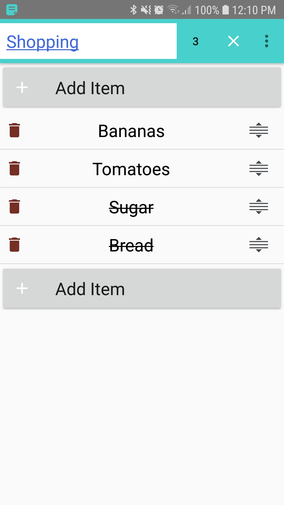
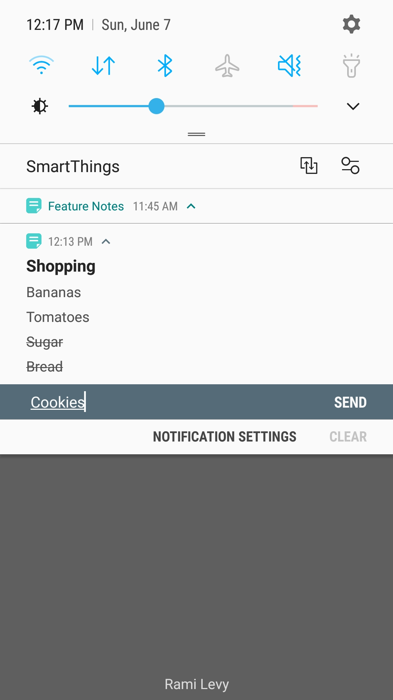
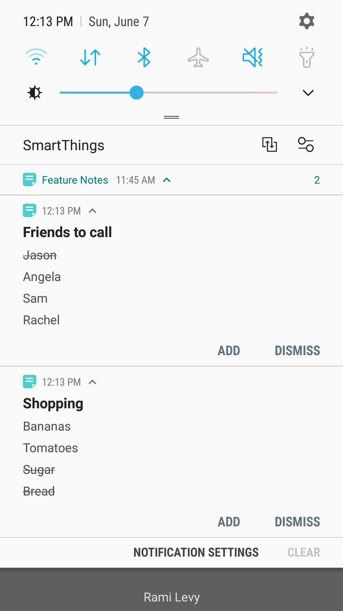
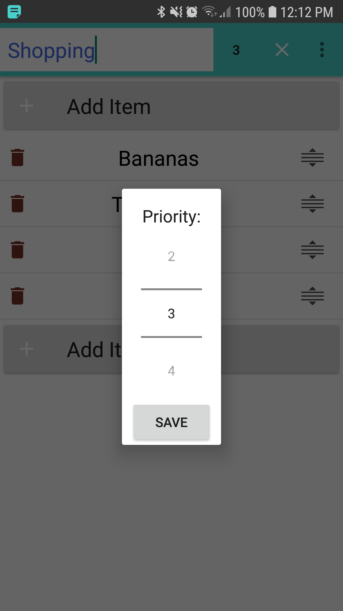

# Notes-App

This project is a hobby project written in Kotlin:

- Architecture Components: MVVM, Room, Kotlin Flow in conjunction with Live Data.
   

 

Basic Notes app for Android. Feel free to use it and build upon it.

 
